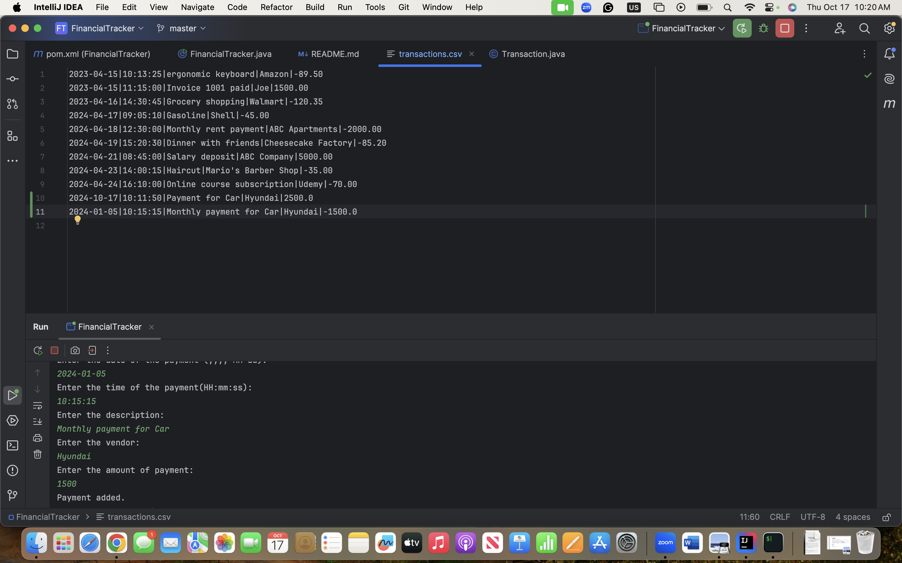
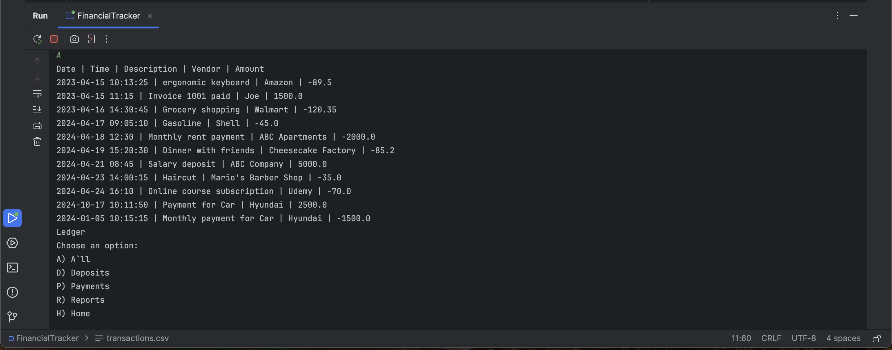
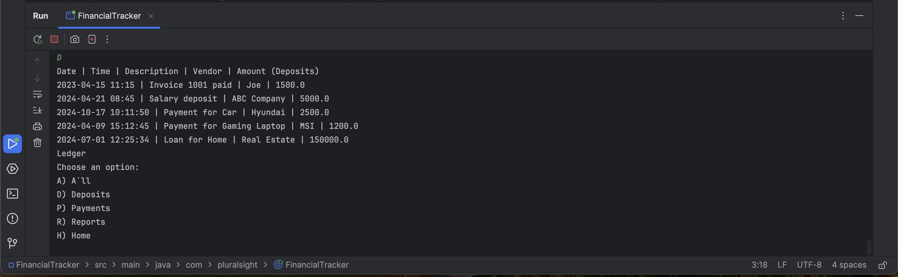
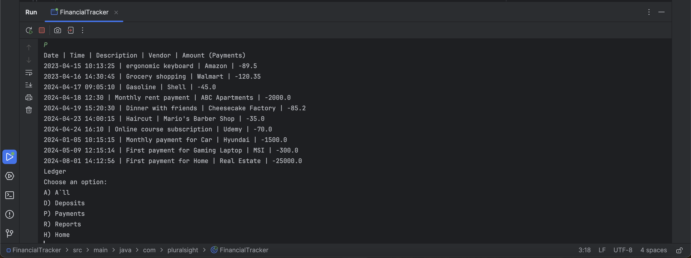
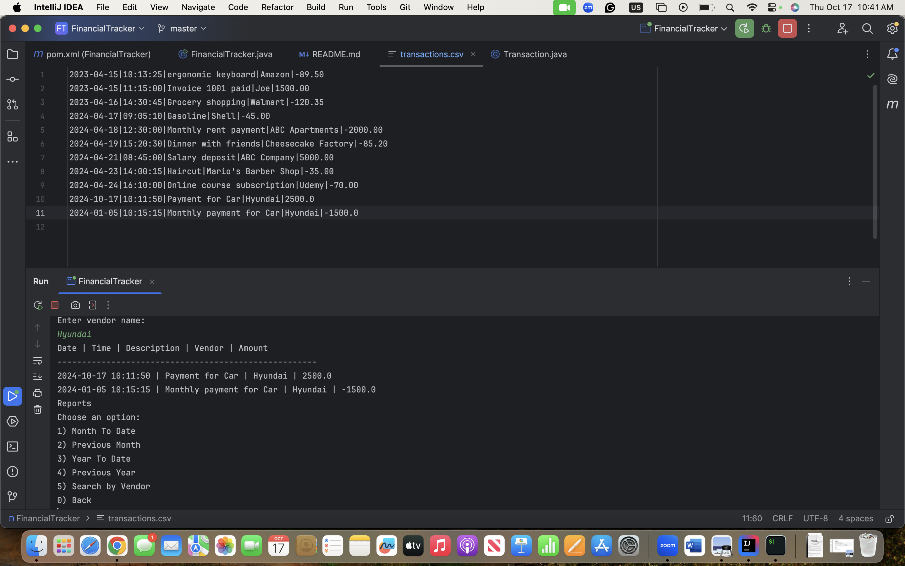
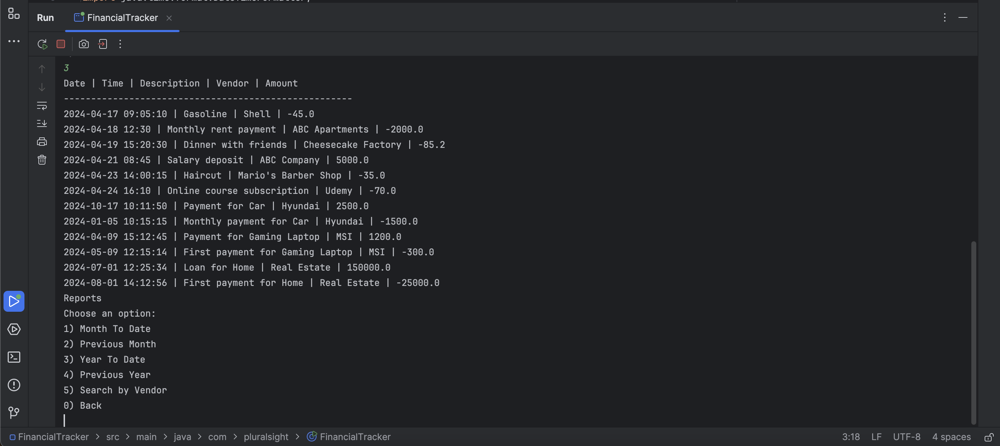

# Project Title

Financial Tracker Capstone

## Description of the Project

- This is a simple Java application called "Financial Tracker", this allows users to record and manage their transactions, as deposits and payments. 
- Users can enter details like the date, time, description, vendor, and amount for each transaction. 
- The application helps users keep track of their finances by storing transaction data in a file and providing reports for analysis.
- That was designed for users who want to keep a basic record of their payments and deposits.

## User Stories

List the user stories that guided the development of your application. Format these stories as: "As a [type of user], I want [some goal] so that [some reason]."

- As a user, I want to have the home screen, so that I can easily navigate my transactions between options.
- As a user, I want to add a deposit by entering the date, time, description, vendor, and amount so that I can record transactions.
- As a user, I want to add a payment by entering the date, time, description, vendor, and amount so that I can record my expense transactions.
- As a user, I want my transactions to be saved to a file so that my data is preserved even after I close the application.
- As a user, I want to access a ledger menu, allowing me to easily navigate through different transaction display screens.
- As a user, I want to view all of my transactions in a list so that I can see a complete overview of my financial activity.
- As a user, I want to view only my deposits so that I can quickly see all of my income sources.
- As a user, I want to view only my payments so that I can focus on my expenses and manage my budget.
- As a user, I want to have an option for report menu, so that I can navigate different filtering options.
- As a user, I want to see transactions within a specific date range so that I can analyze my spending or income over a particular period.
- As a user, I want to search for transactions by vendor so that I can easily find all transactions with a specific vendor.
## Setup

Instructions on how to set up and run the project using IntelliJ IDEA.

### Prerequisites

- IntelliJ IDEA: Ensure you have IntelliJ IDEA installed, which you can download from [here](https://www.jetbrains.com/idea/download/).
- Java SDK: Make sure Java SDK is installed and configured in IntelliJ.

### Running the Application in IntelliJ

Follow these steps to get your application running within IntelliJ IDEA:

1. Open IntelliJ IDEA.
2. Select "Open" and navigate to the folder where you have the project files.
3. Wait for IntelliJ to index the project files and set everything up.
4. Find the main class (FinancialTracker) with the public static void main(String[] args) method.
5. Follow the instructions in the console to add deposits, make payments, and generate reports.

## Technologies Used

- Java: Version 17.
- IntelliJ IDEA.

## Demo

- addDeposit method has been demonstrated. 
- addPayment method has been demonstrated. 
- LedgerMenu has been demonstrated. 
- Show Deposits has been demonstrated. 
- Show Payments has been demonstrated. 
- Search by Vendor has been demonstrated. 
- Year to Date has been demonstrated. 
- 
## Future Work

Outline potential future enhancements or functionalities you might consider adding:

- Edit and Delete Transactions: Allow users to edit or delete transactions.
- Advanced Search: Add more search options like searching by description or amount.
- Spending Limits and Notifications: Introduce spending limits notify users.

## Resources

List resources such as tutorials, articles, or documentation that helped you during the project.

- https://www.w3schools.com/java
- https://www.geeksforgeeks.org/localdate-withdayofyear-method-in-java-with-examples/
- https://yearup.brightspace.com/d2l/home/8605

## Team Members

- **Name 1** - Taha Bilmen.

## Thanks

Express gratitude towards those who provided help, guidance, or resources:

- Thank you to [Raymond] for continuous support and guidance.
- A special thanks to all teammates for their dedication and teamwork.